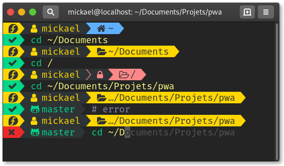

# My-ZSH

Guide to install Zsh + Oh-my-Zsh + PowerLevel10k + NerdFonts + some CLI utils for an awesome shell.

---

<p align="center">
  
  <br>
</p>

---

## 👨‍💻 Zsh

📖 https://github.com/robbyrussell/oh-my-zsh/wiki/Installing-ZSH

```bash
# 🐧 Linux Fedora
sudo dnf install util-linux-user zsh lsd
# 🐧 Linux Debian based (Ubuntu, Mint, Deepin...)
sudo apt install zsh lsd
# 🍎 OSX
brew install zsh lsd
```

## 📦 Oh-My-Zsh

📖 https://github.com/robbyrussell/oh-my-zsh

```bash
# ✌ all
sh -c "$(curl -fsSL https://raw.github.com/robbyrussell/oh-my-zsh/master/tools/install.sh)"
```

## 💪 PowerLevel10k

📖 https://github.com/romkatv/powerlevel10k

```bash
# ✌ For all
git clone https://github.com/romkatv/powerlevel10k $ZSH_CUSTOM/themes/powerlevel10k
git clone https://github.com/zsh-users/zsh-autosuggestions $ZSH_CUSTOM/plugins/zsh-autosuggestions
git clone https://github.com/zsh-users/zsh-syntax-highlighting $ZSH_CUSTOM/plugins/zsh-syntax-highlighting
```

## ⚙️ Zsh config

```bash
cd && curl -fLo ".zshrc" https://github.com/miaborde/my-zsh/raw/master/.zshrc
```

## 🔠 NerdFonts

📖 https://github.com/ryanoasis/nerd-fonts

```bash
# 🐧 Linux
mkdir -p ~/.local/share/fonts
cd ~/.local/share/fonts

# 🍎 OSX
cd ~/Library/Fonts

# ✌ Then for all
curl -fLo "Fira Code Bold Nerd Font Complete.ttf" https://github.com/ryanoasis/nerd-fonts/raw/master/patched-fonts/FiraCode/Bold/complete/Fira%20Code%20Bold%20Nerd%20Font%20Complete.ttf
curl -fLo "Fira Code Light Nerd Font Complete.ttf" https://github.com/ryanoasis/nerd-fonts/raw/master/patched-fonts/FiraCode/Light/complete/Fira%20Code%20Light%20Nerd%20Font%20Complete.ttf
curl -fLo "Fira Code Medium Nerd Font Complete.ttf" https://github.com/ryanoasis/nerd-fonts/raw/master/patched-fonts/FiraCode/Medium/complete/Fira%20Code%20Medium%20Nerd%20Font%20Complete.ttf
curl -fLo "Fira Code Regular Nerd Font Complete.ttf" https://github.com/ryanoasis/nerd-fonts/raw/master/patched-fonts/FiraCode/Regular/complete/Fira%20Code%20Regular%20Nerd%20Font%20Complete.ttf
curl -fLo "Fira Code Retina Nerd Font Complete.ttf" https://github.com/ryanoasis/nerd-fonts/raw/master/patched-fonts/FiraCode/Retina/complete/Fira%20Code%20Retina%20Nerd%20Font%20Complete.ttf
```

## 🔧 Changing monospace fonts system-wide

```bash
# 🐧 Linux (Gnome DE)
gsettings set org.gnome.desktop.interface monospace-font-name 'FiraCode Nerd Font Regular 14'
```

> **🍎 OSX**  
> Open Terminal --> Go to Preferences -->  
> Go to Profiles -- and under text, you can change the font for **'Fira Code Regular Nerd Font Complete 14'**.

## 🔌 NVM as an Oh-My-ZSH plugin

📖 https://github.com/lukechilds/zsh-nvm

```bash
# ✌ For all
git clone https://github.com/lukechilds/zsh-nvm $ZSH_CUSTOM/plugins/zsh-nvm

# uncomment 'zsh-nvm' in your .zshrc plugins section.
```

## 🕹 Enjoy
